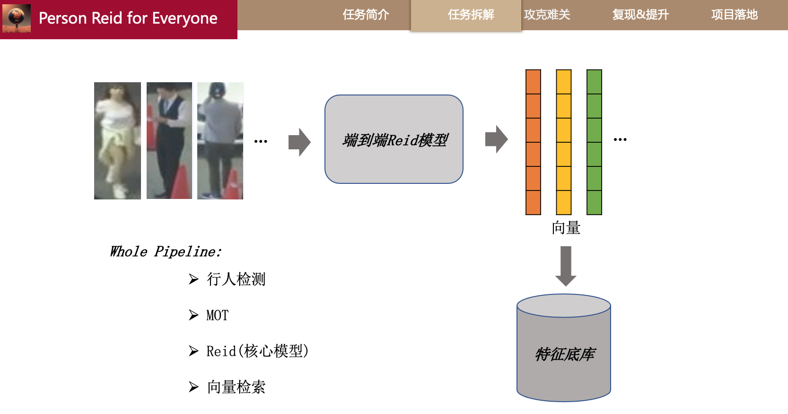

# YOLOv8_Reid: 2024 SOTA 行人重识别demo系统

## 系统展示: 🎉 
[b站](https://www.bilibili.com/video/BV1sC41157cc/)

## 系统过程

### Person Reid
> 任务目的:  使用一张人的全身照,在视频or图像中找到这个人出现的时刻。

 

## 1. 问题拆分:
> 我们如果要落地一个行人重识别的应用项目.我们需要按照pipeline的任务模块将其拆解。简单来说，如图所示，对于图像来说，我们的一般流程是先行人检测,将目标行人的位置提取出来,进行裁剪后面送到reid模型中。对于视频来说，特别是背景稳定的视频如监控，不同的点在于，我们可以使用MOT（多目标跟踪）其是使用滤波位置等信息采用低计算量的方式跟踪一个人。我们在这里就可以设计一个缓存，对于跟踪的一个人只去调reid模型一次(这个可以设置超产),这里其实就是工业界常用的抓拍机策略。  
* For image: 行人检测-> person reid -> vector search -> matching.
* For video:  行人检测 -> 多目标跟踪(MOT) -> person reid -> vector search -> matching

**pipeline拆分为四大模块:**
*  **行人检测:** YOLO检测器 or 其他的detection模型(技术成熟).
*  **MOT:**  使用滤波/位置等信息跟踪, 来减少调用reid 模型的次数，从而来加速(reid相对track耗时很多，技术成熟)。
* **Search engine:**  Faiss 向量检索库支持物理加速和算法加速(有损)。
*	**Person Reid:**  将目标图像映射到特征空间上, 即输入图像输出vector。这一类属于metric learning, 核心思想是类内相近,类间相远。

## 2. 攻克难关:
### 1.调研核心算法reid端到端模型.
* step1:找目前该任务学术界的SOTA.
> 1. 找到该任务的公开数据集.MSMT17数据集更大ID更多,为我们参考的主metircs.

 

> 2. 在paperswithcode.com上找到该数据集指标最高的几篇论文。

> 3.认真阅读这些论文,看看论文的idea与method(是否存在秀技但泛化性弱)，拿上图为例,公平的对比是without re-ranking & without extra trainning data. 最后我们选择clip-ReID作为我们的baseline. 

**NOTE:** cam_id和view这些先验信息对于通用模型是没有这些标签的,所有最好不加。

> 4.认真阅读论文和代码

 
**一句话讲清做了什么:** 
**挑战**：几乎所有的ReID方法都需要在ImageNet上训练的初始模型，该数据集包含了手动给定的图像和预定义集合中的一组标签。完全***忽略了描述丰富语义的视觉内容。***  什么样的模型有这样丰富语义数据呢-当然是在上亿数据对上训练的多模态大模型。

**作者方案:** 想把多模态大模型上视觉和文本描述两个对齐模态的能力迁移到纯视觉下游任务上. 
**作者分了两步.**
* 1.训练不动clip的参数，构建类似person_num个可学习token，每个token代表一个人。（本质:Textual Inversion）
* 2.训练只动visual encoder参数，让它和文本模态对齐。Inference也只有visualencoder

## 3.改进模型.
几乎所有DNN模型就两个结构: backbone + task head。训练模型只有三步： 1.改写dataloader(数据增强等trick) 2.模型结构调试(比如:a.backbone换成更深的网络,用更强的预训练参数;) 3.make loss.
由于up主的时间有限: 尝试了1与3, 最终将mAP 0.734 ->0.737, R1 0.887 ->0.891
 

up主尝试将market-1501的所有数据再加上msmt17的training set 来训练, eval在msmt17的val set上。但很奇怪指标没提升：
 

## 4.up主的一些改进意见
### 4.1 如果要打竞赛
* 最简单的方法: backbone换一下/预训练的参数换成更强的,目前用的的是opanai-clip-vit-b-16 排名71.

 

### 4.2 不成熟的idea(也许指标有提升可到顶会borderline水平).
* a. 论文作者已经证明了camid与view这些信息有用,但这些信息对于有些数据集是缺失的,设计一个learnable memory bank.用网络参数去学习这些差异性
* B. 借助多模态大模型,生成文本物料, 比如:文本形式为:上身为x色的_衣服.等.模型结构采用cross encoder,设计masking modeling预训练任务去加强细粒度的对齐。

## 5.落地项目:
* 1.	设计GUI,画交互图和UI.

* 2.	trainning的checkpoint删除梯度等信息转化为跨平台的inference模型(onnx)
* 3.	串联pipeline,参考设计模式,多线程/异步/同步/数据库同步等
* 4.	设计测试用例,测试debug

这样我们就丝滑地做成了在算法上非常有竞争力的一个项目。

## 6. Install & Run （我们的安装和测试非常简单,只需你会装conda就行）
 博主测试：win11/macbook正常运行。

*  step1: conda create -n reid_gui python=3.8
* step2: conda activate reid_gui
* step3: If mac or linux OS: sh install.sh; or win OS: ./install.bat
*  step4: cd GUI; python main.py

## 7. 结束语

对于创意项目，我会倾向于选择那些具有较大工作量、相对较难且有未来前景的项目进行实现。这也导致完成一个课题项目可能需要2到3个月甚至更长的时间，因此更新的频率会相对较慢。

***同时，欢迎大家在评论区留言，分享任何新颖有趣的课题，我将考虑并予以实现。***

***行人重识别项目代码和更新地址见我的[面包多](https://mbd.pub/o/bread/mbd-ZZ6Um5xs)平台。***

***车辆重识别项目代码和更新地址见我的[面包多](https://mbd.pub/o/bread/mbd-ZpWUmZts)平台。***